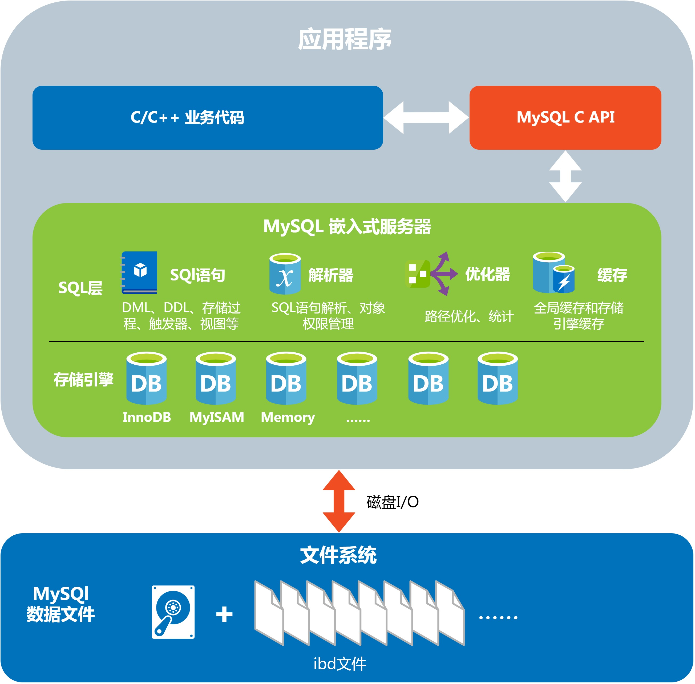
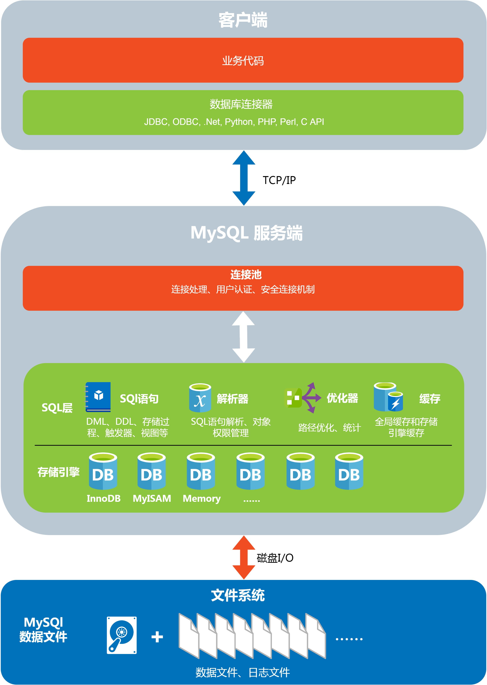

# 1、MySQL Embedded 简介

## 1、初识MySQL Embedded

MySQL Embedded是由MySQL官方支持的一种特性，您可以在一个客户端应用中运行一个完整的MySQL服务器（部分功能受限制），无需服务器/客户端连接。这么做带来的好处是更高的性能和更加便捷的数据管理机制。不过，您需要使用MySQL作为嵌入式服务器的话，只能使用C/C++来开发，MySQL并未提供其他语言的嵌入式服务器函数库。

我们在本教程中使用的MySQL Embedded对应的函数库在MySQL官方文档中叫做libmysqld，是一个嵌入式的MySQL服务器函数库。与之相对应的客户端版本的函数库是libmysqlclient。libmysqld这个库大家可以使用版本有MySQL 5.5、5.6、5.7，早期版本的MySQL BUG众多不推荐大家使用。本教程主要使用的是5.7.23版本的MySQL。

非常遗憾的是，从MySQL 8.0开始不再支持嵌入式服务器这一特性，我们可以使用的最后一个官方支持的libmysqld版本也就是5.7.23了。

#### 下面通过两张架构图来比较一下嵌入式版本和服务器版本MySQL的不同：

#### MySQL 嵌入式版本和客户端版本在开发上的异同：

1. MySQl 嵌入式版本和客户端版本API完全一致
2. MySQl 嵌入式版在调用任何函数之前，需要调用mysql\_library\_init\(\)接口来初始化嵌入式服务器运行环境
3. 同样的，在您的应用退出之前需要调用mysql\_library\_end\(\)来结束嵌入式服务器
4. 在多线程应用中，在任何一个线程内调用MySQL API之前需要先调用mysql\_thread\_init\(\)函数
5. 同样的，在线程退出时要调用mysql\_thread\_end\(\)
6. 嵌入式版本在创建MySQL连接时默认禁用身份验证，无需用户名和密码即可连接数据库
7. 编译时链接libmysqld.a/libmysqld.so而不是libmysqlclient.a/libmysqlclient.so
8. 两个版本的MySQL均使用相同的头文件

#### MySQL嵌入式版本不支持的特性：

1. 用户自定义函数（UDFs）
2. 核心转储（Core dump）时没有堆栈跟踪
3. 没有主机和从机的设置选项，无法使用双机热备
4. 低内存硬件平台上无法获取过大的查询结果
5. 在一个应用内部启动的嵌入式服务器无法通过Socket或者TCP/IP连接在应用外部访问，除非您实现了一个中间层用于外部访问
6. InnoDB在嵌入式服务器中是不可重入的，一个应用内只能通过一个连接访问InnoDB存储引擎
7. 无法使用事件调度功能
8. 没有使用（此处有问题）初始化数据库目录之前，无法使用触发器和存储过程
9. 无法使用Performance Schema
10. MySQL嵌入式服务器无法与其他MySQL服务器共享secure\_file\_priv参数指定的文件或文件夹

## 2、我的应用是否应该选择MySQL Embedded

MySQL Embedded提供和MySQL服务器版本一样强大的功能，在开始你的应用之前，应该先评估是否需要这么多功能。

 如果您的应用是数据密集型的，需要使用到并发写入、读取的功能，那么MySQL Embedded无疑是一个正确的选择。如果您的应用仅仅是有一些关系型数据的存储需求，不需要处理大量数据，可以使用SQLite这样的小型嵌入式数据库。

 使用MySQL进行应用程序的开发需要考虑的因素非常多，涉及到服务器的配置、存储引擎的选择、SQL语句的优化、表结构的优化。选择了MySQL Embedded来进行开发，开发人员必须熟悉MySQL的相关特性，才能完全释放其巨大潜力，否则会导致开发出的应用性能低于预期。

 此处列举一些MySQL的特性（此处有问题）

## 这一节，你学到了：

1. 什么是MySQL Embedded
2. MySQL Embedded的一些特性

